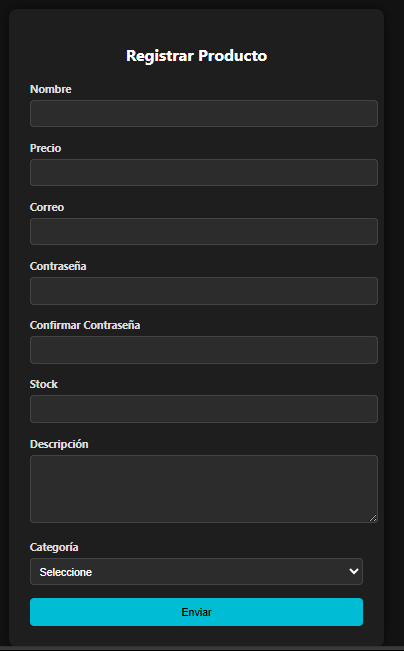
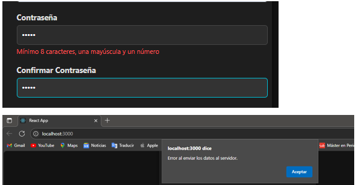
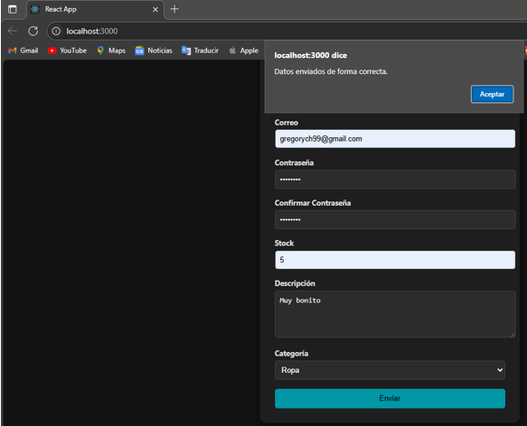
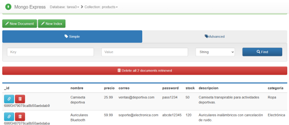

# Tarea 3 – Programación Avanzada

**Nombre:** Karlos Gregory Chevez Bazan  
**Materia:** Programación Avanzada  
**Unidad 2: Desarrollo Full Stack con Validaciones y Persistencia de Datos**  
**Repositorio GitHub:** [U2Tarea3_ChevezKarlos_Avanzada](https://github.com/gregoryNa9/Tarea3PA.git)

---

## Descripción del Proyecto

Este proyecto consiste en la creación de un formulario web completo con validaciones del lado del cliente y del servidor, utilizando una arquitectura full stack basada en React para el frontend y Node.js con Express y MongoDB para el backend. La base de datos se gestiona mediante contenedores Docker y una interfaz visual usando mongo-express.

El formulario permite registrar productos con campos como nombre, precio, correo, contraseña, stock, descripción y categoría. Los datos se validan en el navegador antes de ser enviados al servidor, donde se realizan validaciones adicionales antes de almacenarlos en MongoDB.

---

## Tecnologías y Dependencias

### Frontend

- React
- JavaScript (ES6)
- CSS
- Fetch API

### Backend

- Node.js
- Express.js
- Mongoose
- cors
- dotenv

### Base de Datos

- MongoDB
- mongo-express
- Docker

---

## Estructura del Proyecto

U2Tarea3_YasigJuan_Avanzada/
│
├── backend/
│ ├── db.js # Conexión a la base de datos MongoDB (antes MySQL)
│ ├── server.js # Lógica del servidor y validaciones backend
│ ├── controllers/
│ │ └── product.controller.js # Controlador de producto
│ ├── models/
│ │ └── product.js # Esquema Mongoose
│ ├── routes/
│ │ └── products.routes.js # Rutas del API
│ └── package.json # Dependencias de Node.js
│
├── frontend/ (React)
│ ├── public/
│ ├── src/
│ │ ├── components/
│ │ │ └── Formulario.js # Formulario de registro con validaciones
│ │ ├── services/
│ │ │ └── api.js # Servicio para conectar con backend
│ │ ├── App.js
│ │ └── index.js
│
├── imagenes/ # Evidencias de ejecución y validaciones
│
├── docker-compose.yml # Configuración para MongoDB y mongo-express
├── .gitignore # Archivos y carpetas ignoradas por Git
└── README.md # Documentación del proyecto

---

## Validaciones Realizadas

### Frontend (React)

- Todos los campos son requeridos
- El correo debe tener un formato válido
- La contraseña debe tener al menos 6 caracteres y una letra mayúscula
- El campo de descripción no debe exceder los 200 caracteres
- El stock y el precio deben ser numéricos y mayores a 0

### Backend (Node.js + Express)

- Validaciones similares a las del frontend para mayor seguridad
- Manejo de errores de forma estructurada
- Respuestas en formato JSON para facilitar integración

---

## Ejecución del Proyecto

### Requisitos

- Node.js y npm instalados
- Docker y Docker Compose
- Editor de código (por ejemplo, VSCode)

### Instrucciones

1. Clonar el repositorio:
   \`\`\`
   git clone  https://github.com/gregoryNa9/Tarea3PA.git
   \`\`\`

2. Levantar los contenedores de MongoDB y mongo-express:
   \`\`\`
   docker-compose up -d
   \`\`\`

3. Instalar dependencias del backend:
   \`\`\`
   cd backend
   npm install
   \`\`\`

4. Iniciar el servidor:
   \`\`\`
   node server.js
   \`\`\`

5. Ejecutar el frontend con React:
   \`\`\`
   cd consumo-api-rest
   npm install
   npm start
   \`\`\`

6. Abrir el navegador en \`http://localhost:3000\` para probar el formulario.

---
## Vista previa

- Formulario responsive

- Mensajes de error y éxito mostrados en una modal.

- Verificacion de los datos en Base de datos MongoExpress

## Notas Finales

- El proyecto utiliza MongoDB local a través de Docker. Asegúrate de tener los contenedores corriendo antes de enviar datos.
- La interfaz de mongo-express estará disponible en \`http://localhost:8081\` para visualizar los datos registrados.
- Para pruebas en producción se recomienda agregar cifrado de contraseñas y control de acceso.

EOF